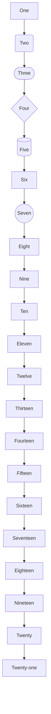
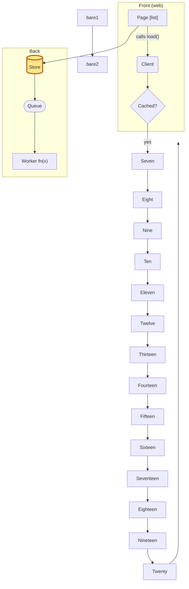

# Too many boxes

The first picture has 21 boxes. The second has exactly 20: subgraph names, edge labels, bare ids, a box drawn twice and brackets inside a label are not boxes.

```mermaid
flowchart TB
  n1["One"] --> n2("Two") --> n3(["Three"])
  n3 --> n4{"Four"} --> n5[("Five")]
  n5 --> n6[Six] --> n7((Seven))
  n7 --> n8["Eight"] --> n9["Nine"] --> n10["Ten"]
  n10 --> n11["Eleven"] --> n12["Twelve"] --> n13["Thirteen"]
  n13 --> n14["Fourteen"] --> n15["Fifteen"] --> n16["Sixteen"]
  n16 --> n17["Seventeen"] --> n18["Eighteen"] --> n19["Nineteen"]
  n19 --> n20["Twenty"] --> n21["Twenty-one"]
```

```mermaid
flowchart TB
  subgraph front["Front (web)"]
    a1["Page [list]"] -->|"calls load()"| a2("Client")
    a2 --> a3{"Cached?"}
  end
  subgraph back["Back"]
    a4[("Store")] --> a5(["Queue"])
    a5 --> a6["Worker fn(x)"]
  end
  a1["Page [list]"] --> a4
  a3 -->|yes| a7["Seven"] --> a8["Eight"] --> a9["Nine"] --> a10["Ten"]
  a10 --> a11["Eleven"] --> a12["Twelve"] --> a13["Thirteen"] --> a14["Fourteen"]
  a14 --> a15["Fifteen"] --> a16["Sixteen"] --> a17["Seventeen"] --> a18["Eighteen"]
  a18 --> a19["Nineteen"] --> a20["Twenty"] --> front
  bare1 --> bare2
  style a4 fill:#fde68a,stroke:#b45309,stroke-width:3px
```
