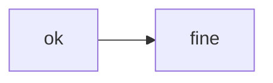

# Links that are fine

[a](good.md "Title") [b](good.md 'Title') [c](<good.md> "T") [d](good.md?plain=1) [e](good.md#x)


```mermaid
  %% a comment first
  flowchart LR
    A["ok"] --> B["fine"]
```

    ```mermaid
    not a fence, an indented code block
